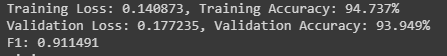

# Mscs19008_COVID19_DLSpring2020
“This   repository   contains   code   and   results   for   COVID-19   classification   assignment   by   Deep   Learning   Spring   2020   course   offered   at   Information   Technology   University,   Lahore,   Pakistan.   This   assignment   is   only   for   learning   purposes   and   is   not   intended   to   be   used   for   clinical   purposes.”   

## -----------------------------------------Part 1----------------------------------------------

## Dataset: 
   Link: https://drive.google.com/drive/u/1/folders/1-FzZhQO9oHIT9SNOWYoKsuz7fe447vtR?authuser=1
   
## Tuned model:
   Link: https://drive.google.com/open?id=1FLE3OeKp4ltOFiJW82-gAdTiddsn-7j2

## Model used:
   1) Vgg 16
   2) Resnet 18
    
## Exerimental Setup:
   For different experimentations on the dataset different models and hyper-parameters were chosen. These are given below.
   
   • Pre-trained models Vgg16 and Resnet18.
   
   • First task was to perform experiments on both models with the CNN part freeze and only FCN unfreeze.
   
   • Second task was to perform experiments on both models with CNN and FCN both unfreeze and also, CNN partially freeze.
   
   • The FCN part of the both networks were altered according to given assignment. The problem was binary so output layer had to be           changed. Also, the number of neuron in hidden layers were also changed.
       
   • Learning rates used were 0.001, 0.0001, and 0.00001.
   
   • Momentum used was 0.9.
   
   • Batch sizes used were 60, 120.
   
   • Loss used was Cross-Entropy.
   
   • Optimizer used was SGD.

## Results:

   ### -----> Task 1
   The best performance on Task 1 that I got is
   
    
   
  

   ### -----> Task 2
   The best performance on Task 2 that I got is
   
    
   
  
  
## ------------------------Part 2: With Focal Loss (Multi-label)----------------------------

## Dataset: 
   Link: https://drive.google.com/file/d/1eytbwaLQBv12psV8I-aMkIli9N3bf8nO/view
   
## Tuned model:
   Link: https://drive.google.com/open?id=1HHqqrAwJmFud32tttvbvfspULxo4gVpZ

## Model used:
   1) Vgg 16
   2) Resnet 18
   
## Experimental setup:
   For different experimentations on the dataset different models and hyper-parameters were chosen. These are given below.
   
   • Pre-trained models Vgg16 and Resnet18.
   
   • Perform Classification without Focal loss using BCEWithLogits.
   
   • Perform Classification with Focal loss.

   • The FCN part had one hidden layer with 2048 neurons
       
   • Learning rates used were 0.0001, which was changed to 0.001 after some epochs.
   
   • Momentum used was 0.9.
   
   • Batch sizes used were 120.
   
   • Optimizer used was SGD.
   
   •	For Focal loss the values for alpha and gamma were 0.25 and 2.

## Results:
   ### Without Focal Loss
   
   #### -----> VGG
     
      
    
   
   #### -----> Resnet
     
     
    
   
   
   ### With Focal Loss
   
   #### -----> VGG
     
      
   
   
   #### -----> Resnet
     
     
    
